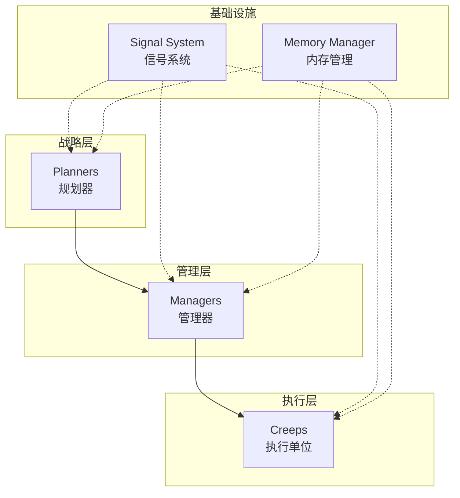

# LiangyiBot - Screeps AI 项目

一个基于 TypeScript 的 Screeps 游戏 AI 项目，采用信号驱动架构实现高度模块化和可扩展的自动化殖民地管理系统。

## 🎯 项目概述

LiangyiBot 是一个先进的 Screeps AI，专注于：
- **智能资源管理**：自动化的采集、运输和分配系统
- **建筑规划**：基于交通流量的道路规划和建筑布局优化
- **跨房间扩张**：智能的相邻房间探索和资源利用
- **信号驱动**：完全解耦的模块间通信机制

## 🏗️ 架构设计

### 核心理念
项目采用 **信号驱动架构**，所有组件通过信号系统进行通信，实现高度解耦和可维护性。

### 目录结构
```
src/
├── managers/          # 管理器 - 负责高级决策和资源分配
│   ├── SpawnManager.ts        # 生产管理：智能生成creep
│   ├── SupplierManager.ts     # 供给管理：spawn/extension能量供应
│   ├── MinerManager.ts        # 挖矿管理：矿源分配和监控
│   └── SuicideManager.ts      # 生命周期管理：老化creep处理
├── creeps/            # Creep类 - 具体执行单位
│   ├── BaseCreep.ts           # 基础类：所有creep的公共功能
│   ├── MinerCreep.ts          # 矿工：专精采集特定矿源
│   ├── SupplierCreep.ts       # 供给者：spawn/extension专用运输
│   ├── HaulerCreep.ts         # 搬运工：通用货物运输
│   ├── BuilderCreep.ts        # 建造者：建筑建造和修理
│   └── UpgraderCreep.ts       # 升级者：控制器升级专家
├── planners/          # 规划器 - 战略规划和优化
│   ├── BuildingPlanner.ts     # 建筑规划：交通分析和道路规划
│   └── HarvestPlanner.ts      # 采集规划：矿源分配和跨房间挖矿
├── SignalSystem.ts    # 信号系统核心
├── MemoryManager.ts   # 内存管理工具
└── main.ts           # 主循环入口
```

### 架构分层



## 📡 信号系统

### 设计原理
信号系统是本项目的核心特色，实现了：
- **完全解耦**：组件间无直接依赖
- **事件驱动**：基于发布-订阅模式
- **优先级控制**：重要信号优先处理
- **类型安全**：TypeScript支持的强类型信号

### 基本用法

#### 定义信号
```typescript
export class ExampleCreep extends BaseCreep {
    constructor(creep: Creep) {
        super(creep);
        
        // 定义此类会发出的信号
        this.defineSignal('example.task_started');
        this.defineSignal('example.task_completed');
    }
}
```

#### 发射信号
```typescript
// 发射信号，传递数据
this.emitSignal('example.task_started', {
    creep: this.creep,
    taskType: 'mining',
    target: source
});
```

#### 监听信号
```typescript
// 使用装饰器监听信号，数字表示优先级（越小越优先）
@signal('example.task_started', 10)
protected onTaskStarted(data: { creep: Creep, taskType: string, target: Source }): void {
    console.log(`任务开始: ${data.taskType}`);
}
```

### 核心信号类型

#### Creep 生命周期信号
```typescript
'creep.energy_full'      // creep能量满载
'creep.energy_empty'     // creep能量耗尽
'creep.state_changed'    // creep状态变化
'creep.should_suicide'   // 需要自杀（老化等）
```

#### 资源管理信号
```typescript
'harvest.source_assigned'    // 矿源分配
'harvest.container_full'     // 容器已满，需要hauler
'supplier.energy_crisis'     // 能量危机警报
```

#### 建筑规划信号
```typescript
'building.road_planned'         // 道路规划完成
'building.construction_needed'  # 需要建造建筑
```

## 👥 Creep 角色系统

### 角色分工

#### MinerCreep（矿工）
- **专业性**：一对一绑定矿源，效率最大化
- **智能定位**：自动寻找最佳挖矿位置
- **容器管理**：自动建议和使用容器存储

```typescript
// 矿工会发出容器需求信号
this.emitSignal('miner.container_needed', {
    source: source,
    suggestedPos: bestPosition
});
```

#### SupplierCreep（供给者）
- **专用运输**：专门为spawn和extension供能
- **优先级管理**：spawn > extension > tower
- **危机响应**：能量不足时自动切换紧急模式

#### HaulerCreep（搬运工）
- **任务系统**：基于优先级的任务分配
- **自主模式**：无任务时自动寻找搬运需求
- **动态调度**：响应实时搬运请求信号

#### BuilderCreep（建造者）
- **双重功能**：建造 + 修理
- **智能选择**：优先建造，其次修理
- **状态管理**：装满能量再工作，提高效率

#### UpgraderCreep（升级者）
- **专一升级**：专注控制器升级
- **容器优化**：优先使用控制器附近容器
- **效率监控**：自动检测和建议容器位置

### 统一状态机

所有creep遵循统一的状态切换逻辑：

```typescript
// 状态切换示例
if (this.creepMemory.state === 'working' && this.creep.store.energy === 0) {
    this.setState('harvesting');
    this.say('🔋去采集');
}
else if (this.creepMemory.state === 'harvesting' && this.creep.store.getFreeCapacity() === 0) {
    this.setState('working');
    this.say('🔨去工作');
}
```

## 🧠 智能规划系统

### BuildingPlanner（建筑规划器）
- **交通分析**：统计creep移动轨迹
- **自动道路**：超过10%使用率的地板自动规划道路
- **数据驱动**：基于实际使用数据做决策

### HarvestPlanner（采集规划器）
- **矿源分配**：智能分配矿工到矿源
- **跨房间挖矿**：自动探索相邻房间资源
- **冲突避免**：确保每个矿源位置不过载

```typescript
// 跨房间挖矿示例
const adjacentRooms = this.getAdjacentRooms(currentRoom);
for (const roomName of adjacentRooms) {
    if (this.isRoomAccessible(roomName)) {
        this.exploreRoom(roomName);
    }
}
```

## 🎨 代码风格指南

### TypeScript规范
- **严格类型**：充分利用TypeScript类型系统
- **接口定义**：所有数据结构都有明确接口
- **泛型使用**：提高代码复用性

### 注释规范
```typescript
/**
 * 方法功能描述
 * @param source 参数说明
 * @returns 返回值说明
 */
public assignSource(source: Source): void {
    // 详细的实现逻辑注释
}
```

### 缩进规范
- **最大层数**：代码缩进不超过4层
- **早期返回**：使用guard clauses减少嵌套
- **函数分解**：复杂逻辑拆分为小函数

```typescript
// ✅ 好的写法
protected doWork(): void {
    if (!this.hasEnergy()) {
        this.startHarvesting();
        return;
    }
    
    if (!this.hasTarget()) {
        this.findTarget();
        return;
    }
    
    this.executeWork();
}

// ❌ 避免的写法
protected doWork(): void {
    if (this.hasEnergy()) {
        if (this.hasTarget()) {
            if (this.canWork()) {
                if (this.isInRange()) {
                    // 4层嵌套，太深了
                }
            }
        }
    }
}
```

### 命名规范
- **类名**：PascalCase，如 `MinerCreep`
- **方法名**：camelCase，如 `findUnassignedSource`
- **信号名**：点分命名，如 `miner.container_needed`
- **常量**：UPPER_SNAKE_CASE

## 🚀 运行机制

### 主循环
```typescript
// main.ts
export function loop() {
    // 1. 内存清理
    clearDeadCreeps();
    
    // 2. 管理器更新
    updateManagers();
    
    // 3. 规划器运行
    updatePlanners();
    
    // 4. Creep执行
    runCreeps();
}
```

### 启动流程
1. **内存初始化**：加载或创建房间记忆数据
2. **信号系统启动**：注册所有信号监听器
3. **管理器初始化**：SpawnManager开始评估生产需求
4. **规划器启动**：开始分析房间布局和资源分布
5. **Creep激活**：现有creep开始执行任务

### 扩展指南

#### 添加新的Creep角色
1. 继承 `BaseCreep`
2. 定义角色特有信号
3. 实现 `doWork()` 方法
4. 在对应Manager中添加生产逻辑

#### 添加新的规划器
1. 创建规划器类
2. 定义规划相关信号
3. 在主循环中注册
4. 通过信号与其他组件交互

#### 添加新信号
1. 在相关类中定义信号：`this.defineSignal('new.signal')`
2. 发射信号：`this.emitSignal('new.signal', data)`
3. 监听信号：`@signal('new.signal', priority)`

## 🔧 调试与监控

### 信号调试
```typescript
// 开启信号调试日志
console.log(`📡 信号发射: ${signalName}`, data);
```

### 性能监控
- **CPU使用率**：监控各模块CPU消耗
- **内存使用**：定期清理无用内存数据
- **信号频率**：避免信号风暴

### 常见问题
1. **Creep卡住**：检查路径规划和目标有效性
2. **信号丢失**：确认信号名称拼写和监听器注册
3. **内存泄漏**：及时清理死亡creep的内存数据

## 📚 扩展阅读

- [Screeps官方文档](https://docs.screeps.com/)
- [TypeScript官方手册](https://www.typescriptlang.org/docs/)
- 信号驱动架构设计模式

---

**项目维护者**: 请在修改核心架构时更新此文档
**贡献指南**: 遵循现有代码风格，优先使用信号通信而非直接调用
